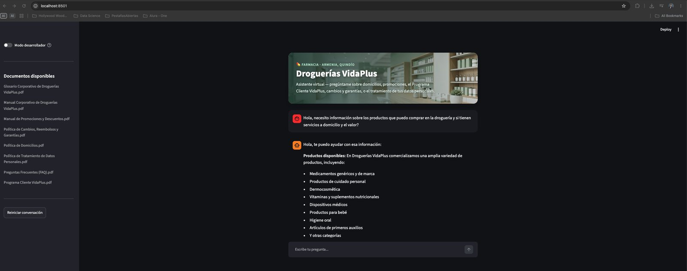
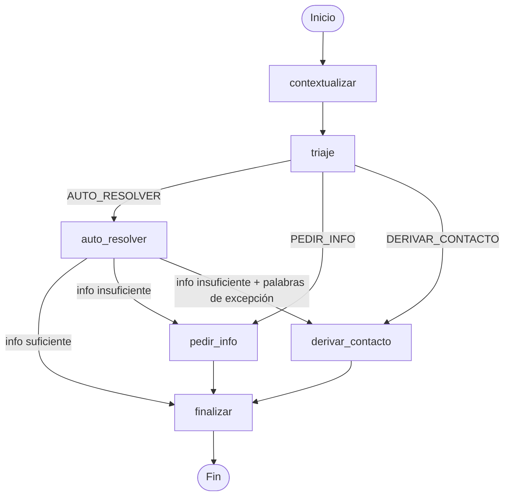

# 💊 Droguerías VidaPlus - Agente Inteligente de Consulta Documental

## Descripción General

Este proyecto implementa un agente inteligente basado en Inteligencia Artificial capaz de responder preguntas en lenguaje natural utilizando como fuente de conocimiento la documentación interna de **Droguerías VidaPlus**, una cadena ficticia de droguerías ubicada en la ciudad de Armenia, Quindío.

El agente combina un paso de **triaje** (para decidir qué tipo de solicitud es) con **Retrieval-Augmented Generation (RAG)** sobre la base documental de la empresa, usando Claude (Anthropic) como modelo de lenguaje. Mantiene memoria de la conversación, por lo que entiende preguntas de seguimiento sin que el usuario tenga que repetir el contexto, y deriva a contacto humano cuando la solicitud lo requiere (excepciones, reclamos formales) o cuando no tiene información suficiente para responder.

### Base de Conocimiento

El agente consulta los siguientes documentos (en `docs/`):

- Manual Corporativo de Droguerías VidaPlus
- Manual de Promociones y Descuentos
- Programa Cliente VidaPlus
- Política de Domicilios
- Política de Cambios, Reembolsos y Garantías
- Política de Tratamiento de Datos Personales
- Preguntas Frecuentes (FAQ)
- Glosario Corporativo

### Interfaz

La interacción con el agente se realiza a través de una interfaz de chat web construida con Streamlit:

---

## Cómo Funciona el Grafo

El agente está implementado como un grafo de estados (LangGraph) con tres decisiones de negocio encadenadas:

1. **¿Hay que entender esto en el contexto de la conversación?** (`contextualizar`) — si es la primera pregunta o un saludo, pasa igual; si es un seguimiento ("¿y en Laureles?"), la reescribe como una pregunta autónoma usando el historial.
2. **¿Qué tipo de solicitud es?** (`triaje`) — clasifica el mensaje en `AUTO_RESOLVER` (pregunta sobre políticas), `PEDIR_INFO` (mensaje ambiguo) o `DERIVAR_CONTACTO` (excepción/reclamo que requiere un humano).
3. **¿De verdad se pudo resolver?** (`auto_resolver`) — busca en la base documental y califica si los fragmentos recuperados son suficientes antes de generar la respuesta; si no lo son, reenvía a `pedir_info` o, si detecta palabras de excepción/autorización, a `derivar_contacto`.

Todos los caminos terminan en `finalizar`, que guarda el turno en el historial de la conversación y arma el resumen de documentos consultados que se le muestra al usuario.

---

## Arquitectura de la Solución

> Esta sección se irá actualizando a medida que avance el proyecto.

- **Triaje**: clasificación de intención con salida estructurada (Claude + `pydantic`), con reglas explícitas y ejemplos por categoría.
- **RAG con calificación de relevancia**: los documentos se dividen en fragmentos, se indexan con embeddings locales (FAISS) y se recuperan por similitud; antes de generar la respuesta, un paso adicional evalúa si los fragmentos recuperados alcanzan para responder (en vez de inferirlo del texto de la respuesta generada).
- **Memoria conversacional**: el grafo persiste el estado entre preguntas de una misma sesión (checkpointer en memoria), y un nodo de contextualización reformula preguntas de seguimiento antes de clasificarlas.
- **Derivación a contacto humano**: para excepciones, autorizaciones especiales o reclamos formales, el agente muestra directamente los canales de contacto reales de la droguería.
- **Separación respuesta / auditoría**: el usuario solo ve la respuesta final y un resumen de los documentos consultados; el contenido crudo de cada fragmento recuperado se registra en logs, no se muestra en la conversación.

---

## Tecnologías y Herramientas Utilizadas

- **Python**
- **Streamlit** — interfaz de chat web (con soporte para cargar documentos nuevos en caliente y un "modo desarrollador" para inspeccionar el triaje)
- **LangChain** / `langchain-anthropic` / `langchain-community` / `langchain-text-splitters` / `langchain-classic`
- **LangGraph** (grafo de estados + memoria conversacional con `MemorySaver`)
- **Claude (Anthropic)** como modelo de lenguaje (`ChatAnthropic`)
- **FastEmbed** — embeddings locales y gratuitos, con un modelo multilingüe (`paraphrase-multilingual-MiniLM-L12-v2`) para trabajar en español
- **FAISS** — base de datos vectorial local
- **PyMuPDF** — lectura de los PDFs de la base de conocimiento
- **Pydantic** — validación y salidas estructuradas (triaje, calificación de relevancia)
- **python-dotenv** — configuración vía variables de entorno (local); `st.secrets` en el despliegue

---

## Instrucciones para Ejecutar el Proyecto

_Pendiente — se documentará en una próxima iteración._

---

## Ejemplos de Preguntas

El agente puede responder preguntas como las siguientes:

1. ¿Qué promociones hay los jueves?
2. ¿Qué beneficios ofrece el Plan Vida Premium?
3. ¿Los descuentos de los lunes aplican pagando con cualquier tarjeta?
4. ¿Puedo devolver un medicamento si ya no lo necesito?
5. ¿Qué sucede si mi pedido llega incompleto?
6. ¿Cuánto cuesta un domicilio?
7. ¿En qué zonas de Armenia realizan domicilios?
8. ¿Puedo solicitar medicamentos con fórmula médica a domicilio?
9. ¿Cómo puedo afiliarme al Programa Cliente VidaPlus?
10. ¿Qué información personal recopila Droguerías VidaPlus?
11. ¿Cómo puedo dejar de recibir promociones por correo o teléfono?
12. ¿Qué ocurre si un producto llega dañado durante el transporte?
13. ¿Los puntos del programa tienen fecha de vencimiento?
14. ¿Qué productos tienen descuento los viernes?
15. ¿Cuál es la diferencia entre un medicamento genérico y uno de marca?
16. Quiero una autorización especial para devolver un medicamento fuera de los plazos. *(ejemplo de derivación a contacto humano)*

---

## Ejemplos de Respuestas Generadas por el Agente

**Pregunta:** ¿Cuánto cuesta un domicilio?

> El costo del domicilio depende de la distancia entre la sede que despacha el pedido y el lugar de entrega:
>
> - Hasta 3 km: $4.000
> - Entre 3 y 6 km: $6.000
> - Más de 6 km: Desde $8.000
>
> El valor definitivo será informado al cliente antes de confirmar el pedido.
>
> **Documentos consultados:** Política de Domicilios.pdf, Preguntas Frecuentes (FAQ).pdf, Programa Cliente VidaPlus.pdf

**Pregunta de seguimiento (misma conversación):** ¿y en Laureles?

> El costo del domicilio depende de la distancia, no específicamente del sector. Laureles es un sector cubierto por la operación en Armenia; para el costo exacto se necesita la distancia desde la sede hasta la dirección del cliente en esa zona.

**Pregunta:** Quiero una autorización especial para devolver un medicamento fuera de los plazos.

> Esta solicitud (urgencia MEDIANA) requiere la atención de un agente humano. Por favor contáctanos directamente:
> 📞 Teléfono / WhatsApp: +57 315 900 00 00
> 📧 Correo: droguerias.vidaplus@gmail.com
> Con gusto te atenderemos personalmente.

**Pregunta:** Necesito ayuda.

> Cuéntame en qué puedo ayudarte: domicilios, promociones y descuentos, el Programa Cliente VidaPlus, cambios/reembolsos/garantías, o el tratamiento de tus datos personales.
